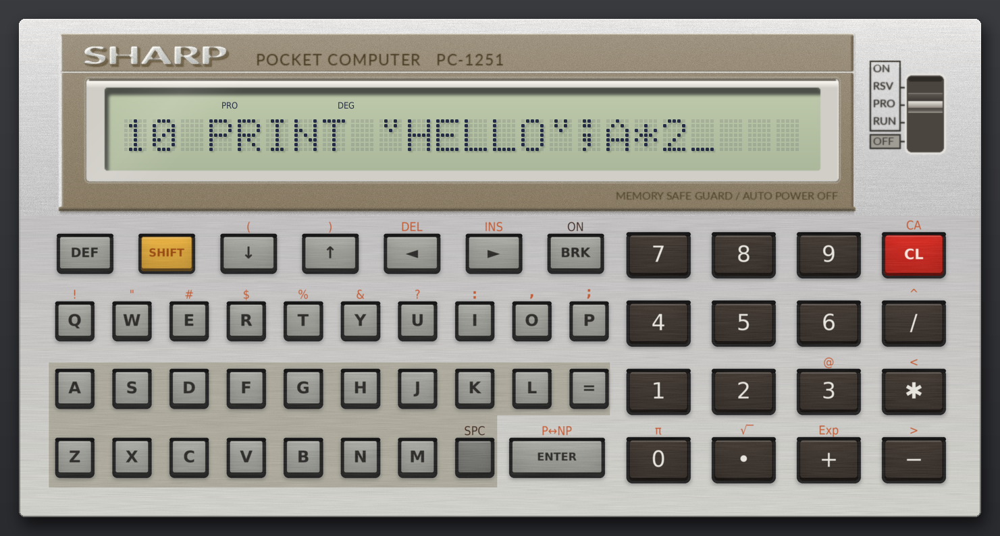
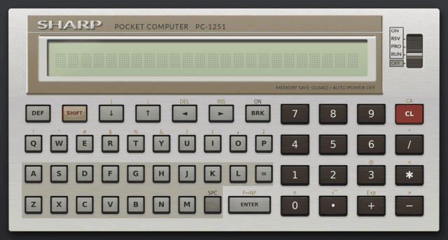

日本語 | [English](README.en.md)

# SHARP PC-1251エミュレータ

1980年代はじめのポケットコンピュータ、シャープPC-1251をパソコンで動かすエミュレータです。CPU(SC61860)を命令単位で実行し、実機の内部ROMとBASIC ROMをそのまま走らせます。BASICもマシン語も動き、キーとモードスイッチはマウスでも操作できます。液晶と本体は、寸法を測り、写真から色を採取して描画しています。





macOSとWindowsでの入れ方から順に書いた使い方の手引きが[`doc/manual.pdf`](doc/manual.pdf)にあります。

## 入れ方

[uv](https://docs.astral.sh/uv/)を使います。Pythonはuvが用意するので、別に入れる必要はありません。

```sh
git clone <このリポジトリのURL>
cd pc1251-emulator
mkdir rom                            # 実機から読み出したROMをここに置く(下を参照)
uv run pc1251                        # 起動
```

### ROMの用意

ROMはシャープの著作物なので、このリポジトリには入れていません。自分のPC-1251から読み出したものを、次の名前で`rom/`に置いてください。

| ファイル | 中身 | 大きさ |
| --- | --- | --- |
| `cpu-1251.rom` | CPU(SC61860)の内部ROM、`0000-1FFF` | 8192バイト |
| `bas-1251.rom` | BASIC ROM、`4000-7FFF` | 16384バイト |

たとえば`~/src`の下に取ってきたなら、`~/src/pc1251-emulator/rom/cpu-1251.rom`と`~/src/pc1251-emulator/rom/bas-1251.rom`になります。

読み出し方は、yagshi氏の「[Extracting ROM Data (ROM吸い出し)](https://www.oit.ac.jp/rd/labs/kobayashi-lab/~yagshi/old_web/misc/pocketcom/extrom.html)」にPC-1251での手順があります。

ROMには版の違いがあるので、確かめるのはファイルの大きさだけです。別の場所に置くときは、環境変数`PC1251_ROM`にその場所を入れます。

## 動かし方

```sh
uv run pc1251 --scale 0.8            # 小さくする
uv run pc1251 primes --run           # 置き場所のprimes.basを読み込んで実行する
uv run pc1251 ~/prog/game.bas        # ファイルを指定して読み込む
uv run pc1251 --fresh                # 保存したRAMを使わずに始める
uv run pc1251 --help                 # オプションの一覧
```

終了するとRAMを`~/.pc1251/ram.bin`に保存し、次に起動したときに戻します。

### プログラムのファイル

`~/.pc1251/programs/`に`.bas`(BASICのテキスト)か`.hex`(`番地 データ`の行が並んだ16進ダンプ)を置くと、プログラムの一覧(Cmd+O、WindowsはCtrl+O)に出ます。Enterで読み込み、Shift+Enterで読み込んで実行します。ウィンドウにドロップしても読み込めます。

エミュレータで打ち込んだBASICのプログラムは、Cmd+E(WindowsはCtrl+E)で`~/.pc1251/programs/`に`名前-日時.bas`として書き出せます。マシン語は書き出しません。`uv run pc1251 --export フォルダ`とすると、保存してあるRAMから書き出します。

`.bas`はPROモードで`NEW`してから全速で打ち込み、`.hex`はRAMにそのまま書きます。`.hex`の行の`;`から後ろはコメントです。同じ名前の`.bas`と`.hex`は組にして、ダンプを書いてからBASICを打ち込みます。

`#`で始まる行はコメントで、`# title: 一覧に出す名前`、`# run: 実行するときに打つ文字列`、`# hex: 先に書き込むダンプのファイル`も書けます。`programs/`には、HELLO、BEEP、素数、文字のアニメーション、計算中の表示、マシン語の正弦波、ブロック崩し、PC-インタープリタ、もぐらたたきの9つの見本があります。

### キー

画面のキーはマウスで押せます。パソコンのキーボードの英字・数字・記号・Enter・Space・矢印もそのまま使えます。

| macOS | Windows | PC-1251 |
| --- | --- | --- |
| Tab | Tab | SHIFT |
| Option | Alt | DEF |
| delete | Backspace | 1字消す |
| fn+delete | Delete | CL |
| Esc | Esc | BRK(電源が切れているときはON) |
| Cmd+↑、Cmd+↓ | Ctrl+↑、Ctrl+↓ | モードスイッチを1段上・下へ |
| Cmd+O | Ctrl+O | プログラムの一覧 |
| Cmd+R | Ctrl+R | 裏のRESETボタン |
| Cmd+T | Ctrl+T | 速さ(1倍と4倍) |
| Cmd+E | Ctrl+E | いまのBASICのプログラムを.basのファイルに書き出す |
| Cmd+S | Ctrl+S | 画面を画像で保存 |
| Cmd+/ | Ctrl+/ | キーの説明 |
| Cmd+V | Ctrl+V | クリップボードの文字を打ち込む |

右クリックでも同じ操作のメニューが出ます。メニューの「プログラムを読み込んで実行」から、見本を選んでそのまま動かせます。日本語入力はオフにしておいてください。

### ブロック崩し

`programs/break.hex`と`break.bas`は、マシン語で書いた横向きのブロック崩しです。↑↓でパドルを動かし、SPACEで玉を打ち出して、右から迫ってくるブロックの壁を削ります。始めに1(EASY、パドル3段)か2(NORMAL、パドル2段)を選びます。

### PC-インタープリタと『PC-インタープリタを読む』

PiO 1986年8月号の「PC-インタープリタ」([Fan_PC-1251](https://x.com/pio1986_10)氏作)も動きます。`programs/pcint.hex`が記事のリスト1、`programs/mogura.bas`がリスト2のもぐらたたきで、作者の了解を得て収めています。

もぐらたたきは右クリックのメニューから選ぶと始まります。もぐらが出た穴の数字キー(1〜6)を押しっぱなしにします。

[`doc/pcinterp.pdf`](doc/pcinterp.pdf)は、このプログラムを1命令ずつ読み解いた小冊子『PC-インタープリタを読む』(おりぐち)です。

## しくみのメモ

| ファイル | 中身 |
| --- | --- |
| `pc1251emu/sc61860.py` | CPUコア。256個のオペコードを関数の表で振り分ける |
| `pc1251emu/machine.py` | メモリ、キーの行列、タイマ、ポート、液晶RAM、電源 |
| `pc1251emu/display.py` | 本体と液晶の描画 |
| `pc1251emu/audio.py` | 圧電ブザーの音 |
| `pc1251emu/app.py` | ウィンドウ、キー操作、自動入力 |
| `pc1251emu/programs.py` | プログラムの置き場所と、.bas/.hexの読み方 |
| `doc/manual.pdf` | 使い方の手引き |

命令の意味はMAMEのSC61860の実装に従い、資料によって扱いが違う`56h`(READ)、`LOOP`、`WAIT n`だけは実機のプログラムの書き方に合わせました。クロックは192kHzです。

メモリは内部ROMが`0000-1FFF`、BASIC ROMが`4000-7FFF`、RAMが`B800-C7FF`、液晶RAMが`F800-F87F`です。

モードスイッチは、ポートIBのビット3を出してINBで読みます。ビット0がRSV、ビット1がPRO、ビット2がOFFで、どれも立っていなければRUNです。OFFを読むとROMは内部RAMの`30h-37h`に印を書いてから自分で電源を切り、次の起動でこの印がないとプログラムを消します。

Cポートは、ビット0が表示、ビット2がCPUの停止(キーか512msのタイマで再開)、ビット3が電源オフ、ビット4〜6がブザーです。ブザーは値が`3`で内蔵の4kHzの発振、`5`と`4`で出力のHIGHとLOWです。

液晶は左半分の60列が`F800-F83B`の順に、右半分が`F87B`から`F840`へ逆順に並びます。表示記号は`F83C-F83E`のビットです。

### 実機と違うところ

- カセットの入出力は動作を確かめていません。`CSAVE`はそれらしい音が出ますが、録音しても実機で読めるとは限りません。`CLOAD`はBRK(Esc)で止めてください。
- プリンタ(CE-125)は動きません。
- ROMの版の違いは確かめていません。
- 内部ROMがBASICの`PEEK`でも読めます(実機では`DATA`命令でしか読めません)。

## 試験

```sh
uv run pytest -q tests
```

ROMがなければ、ROMを使う試験は飛ばします。

## 権利について

このエミュレータのコードと絵はMITライセンスで公開します([LICENSE](LICENSE))。

SHARPはシャープ株式会社の商標です。これは個人が作った非公式のエミュレータで、シャープ株式会社とは関係ありません。
