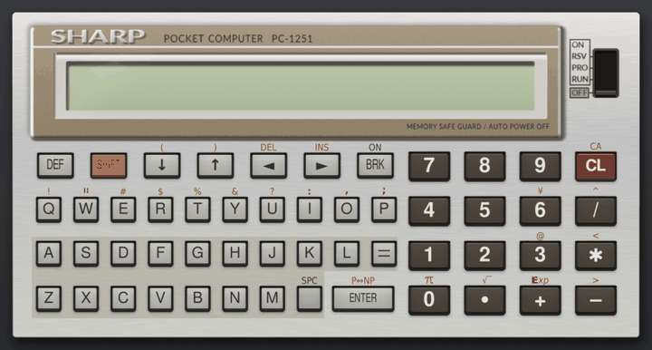
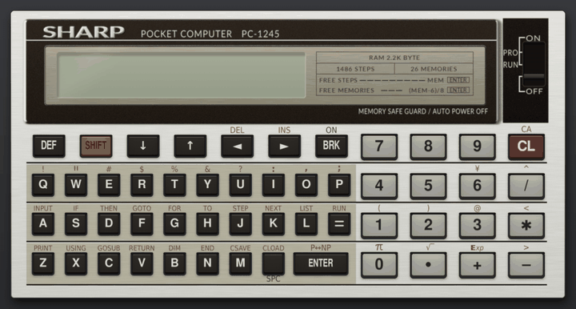

日本語 | [English](README.en.md)

# SHARP PC-1251/PC-1245エミュレータ

シャープのポケットコンピュータPC-1251(1982年)とPC-1245(1983年)をパソコンで動かすエミュレータです。CPU(SC61860)を命令単位で実行し、実機の内部ROMとBASIC ROMをそのまま走らせます。BASICもマシン語も動き、キーとモードスイッチはマウスでも操作できます。起動のときに機種を選び、何も指定しなければPC-1251になります(PC-1245は「[PC-1245として使う](#pc-1245として使う)」)。





macOSとWindowsでの入れ方から順に書いた使い方の手引きが[`doc/manual.pdf`](doc/manual.pdf)にあります。

## 入れ方

[uv](https://docs.astral.sh/uv/)を使います。Pythonはuvが用意するので、別に入れる必要はありません。

```sh
git clone <このリポジトリのURL>
cd pc1251-emulator
mkdir rom                            # 実機から読み出したROMをromに置く(下を参照)
uv run pc1251                        # 起動
```

### ROMの用意

ROMはシャープの著作物なので、このリポジトリには入れていません。実機から読み出したものを、次の名前で`rom/`に置いてください。使う機種のぶんだけあれば動きます。

| ファイル | 中身 | 大きさ |
| --- | --- | --- |
| `cpu-1251.rom` | PC-1251のCPU(SC61860)の内部ROM、`0000-1FFF` | 8192バイト |
| `bas-1251.rom` | PC-1251のBASIC ROM、`4000-7FFF` | 16384バイト |
| `cpu-1245.rom` | PC-1245のCPUの内部ROM、`0000-1FFF` | 8192バイト |
| `bas-1245.rom` | PC-1245のBASIC ROM、`4000-7FFF` | 16384バイト |

たとえば`~/src`の下に取ってきたなら、`~/src/pc1251-emulator/rom/cpu-1251.rom`と`~/src/pc1251-emulator/rom/bas-1251.rom`になります。

読み出し方は、yagshi氏の「[Extracting ROM Data (ROM吸い出し)](https://www.oit.ac.jp/rd/labs/kobayashi-lab/~yagshi/old_web/misc/pocketcom/extrom.html)」にPC-1251での手順があります。PC-1245は、「[SHARP PC-1245/50/51/55 の使い方](https://ht-deko.com/pc1245/)」(ht-deko.com)に、内部ROMを1KBずつ、BASIC ROMを4KBずつ`CSAVE M`で取り出すBASICのリストつきの手順があります。

ROMには版の違いがあるので、確かめるのはファイルの大きさだけです。ROMを別のフォルダに置くときは、環境変数`PC1251_ROM`にフォルダの場所を入れます。

## 動かし方

```sh
uv run pc1251 --scale 0.8            # 小さくする
uv run pc1251 primes --run           # 見本のprimes.basを読み込んで実行する
uv run pc1251 ~/prog/game.bas        # ファイルを指定して読み込む
uv run pc1251 --fresh                # 保存したRAMを使わずに始める
uv run pc1251 --model 1245           # PC-1245として起動する
uv run pc1251 --help                 # オプションの一覧
uv run pc1251 --version              # 版を出す(不具合を知らせるときに添えてください)
```

終了するとRAMを`~/.pc1251/ram.bin`(PC-1245は`ram-1245.bin`)に保存し、次に起動したときに戻します。

### プログラムのファイル

`~/.pc1251/programs/`に`.bas`(BASICのテキスト)か`.hex`(`番地 データ`の行が並んだ16進ダンプ)を置くと、プログラムの一覧(Cmd+O、WindowsはCtrl+O)に出ます。Enter(または選んだ行をもう一度クリック)で読み込んで実行し、Shift+Enterでは読み込むだけにします。ウィンドウにドロップしても読み込めます。

エミュレータで打ち込んだBASICのプログラムは、Cmd+E(WindowsはCtrl+E)で`~/.pc1251/programs/`に`名前-日時.bas`として書き出せます。マシン語は書き出しません。`uv run pc1251 --export フォルダ`とすると、保存してあるRAMから書き出します。

`.bas`はPROモードで`NEW`してから全速で打ち込み、`.hex`はRAMにそのまま書きます。指数を表すE(SHIFT+`+`で入るExpの字)は英字のEとは別の字なので、`.bas`の中では`[E]`か`€`と書きます(たとえば`1[E]-8`。PocketToolsと同じ書き方です)。円周率のπ(SHIFT+`0`で入る字)は`π`と書きます。1行に打てるのは79字までなので、79字より長い行は実機と同じように途中(なるべく`:`のところ)まで打って`ENTER`し、▶で行末へ送ってから続きを打ちます。行を呼び出して直すときの入力欄も行番号と中身で79字までで、打ったばかりの命令の綴りは綴りの字数で数えられます。行末に打ち足していく途中で入力欄からあふれる行は、実機で打つときと同じく、命令の綴りだけを先に打ってから、残りの字を▶で位置を合わせてSHIFT+▶(INS)で途中に挿入します。`.hex`の行の`;`から後ろはコメントです。アセンブラYASM61860が出力する16進ダンプ(`c300 : 02 41 37 …`の形)も、手を加えずに`.hex`として読めます。同じ名前の`.bas`と`.hex`は組にして、ダンプを書いてからBASICを打ち込みます。

`#`で始まる行はコメントで、`# title: 一覧に出す名前`、`# run: 実行するときに打つ文字列`、`# hex: 先に書き込むダンプのファイル`、`# bin: 先に書き込むマシン語のバイナリのファイル名と、置く番地`(例:`# bin: code.bin &C300`)、`# after: 実行の文字列を打ったあとで書き込むダンプのファイル`も書けます。`.bin`のファイル(PocketToolsの`bin2wav`が読む形式)にはマシン語のバイトが並んでいるだけで、置く番地は書かれていないので、`# bin:`の行で番地を指定します。番地は`&C300`、`0xC300`、`C300`のどの形式で書いてもかまいません。`.bin`は`# after:`でも、`# after: code.bin &C400`のように番地をつけて使えます。YASM61860が`-r`で出力する`.bin`は番地0から始まり、ORGで指定した番地より前が0で埋めてあります。`# bin:`で読み込むとRAMのBASICのプログラムや変数まで0で書きつぶすので、YASM61860でアセンブルしたものは16進ダンプ(`-d`)を`.hex`として使ってください。`# after:`は、BASICでDIMをして場所を空けてからマシン語を読み込む記事のためのものです。`# hex:`や`# after:`で使われるだけの`.hex`(同じ名前の`.bas`がないもの)は、一覧には出さず、使う側の行に大きさを出します。置き場所の中の`pc1251/`、`pc1245/`のフォルダに置いたものはフォルダの名前の機種用になり、直下に置いたものはどちらの機種でも使えます。フォルダのかわりに`# model: 1251`と書いても同じです。ほかの機種用のものは一覧に「(PC-1251用)」と出て、読み込みません。同じ名前(`# title:`)でいまの機種用のものがあれば、いまの機種用のものだけが一覧に出るので、機種ごとに作り分けたものは同じ名前で両方のフォルダに置けます。`programs/`には、素数、文字のアニメーション、計算中の表示、マシン語で1ドットずつ流す文字、マシン語の弾むボール、ブロック崩し、PC-インタープリタ、もぐらたたきの8本の見本があります。

### キー

画面のキーはマウスで押せます。パソコンのキーボードの英字・数字・記号・Enter・Space・矢印もそのまま使えます。

| macOS | Windows | 本体 |
| --- | --- | --- |
| Tab | Tab | SHIFT |
| Option | Alt | DEF |
| delete | Backspace | 1字消す |
| fn+delete | Delete | CL |
| Esc | Esc | BRK(電源が切れているときはON) |
| Cmd+↑、Cmd+↓ | Ctrl+↑、Ctrl+↓ | モードスイッチを1段上・下へ |
| Cmd+O | Ctrl+O | プログラムの一覧 |
| Cmd+R | Ctrl+R | 裏のRESETボタン |
| Cmd+T、Shift+Cmd+T | Ctrl+T、Shift+Ctrl+T | 速くする・遅くする(1/2倍、1倍、2倍、4倍、8倍。1倍以外では音の高さも変わる) |
| Cmd+E | Ctrl+E | いまのBASICのプログラムを.basのファイルに書き出す |
| Cmd+S | Ctrl+S | 画面を画像で保存 |
| Shift+Cmd+R | Shift+Ctrl+R | 録画を始める・止めて保存する |
| Cmd+/ | Ctrl+/ | キーの説明 |
| Cmd+V | Ctrl+V | クリップボードの文字を打ち込む |
| Cmd+K | Ctrl+K | 矢印キーを数字キーの8・2・4・6にする/戻す |

Shift+Cmd+R(WindowsはShift+Ctrl+R)で録画を始めると、もう一度押すまでのあいだを、液晶を拡大した絵と本体全体の絵を並べた1280×720の動画(MP4、音つき)に録ります。動画はプログラムの置き場所に`rec-日時.mp4`の名前で保存します。動画を作るのに使うffmpegは、imageio-ffmpegのライブラリと一緒に入ります。imageio-ffmpegがffmpegを一緒に入れるのは、Windows、macOS、Linux(x86_64とaarch64)だけです。ほかの環境でも、エミュレータは入って動きますが、録画するにはffmpegを別に入れてPATHに置いてください。ffmpegが見つからないときは、録画を始めずに画面の下にそのことを出します。

右クリックでも同じ操作のメニューが出ます。メニューの「プログラムの一覧」から見本を選ぶと、そのまま動かせます。日本語入力はオフにしておいてください。

テンキーのないパソコンで、数字キーの8・2・4・6(5を真ん中にした上下左右)を方向に使うゲームをするときは、Cmd+K(WindowsはCtrl+K、F7でも)で矢印キーを8・2・4・6の数字キーとして押すようにできます。もう一度押すと戻ります。起動のときに`--numpad`を付けても同じです。

### ブロック崩し

`programs/pc1251/break.hex`と`break.bas`は、マシン語で書いた横向きのブロック崩しです。↑↓でパドルを動かし、SPACEで玉を打ち出して、右から迫ってくるブロックの壁を削ります。始めに1(EASY、パドル3段)か2(NORMAL、パドル2段)を選びます。面ごとに1つある点滅するブロックを壊すと玉が2個になり、片方を落としても玉は減りません。

PC-1245用は`programs/pc1245/`の`break.hex`と`break.bas`で、一覧ではどちらも「ブロック崩し」として、動かしている機種のものが出ます。PC-1245用は遊ぶ場所を75列にし、遊んでいるあいだは得点を出しません(終わってから出ます)。容量の都合で、PC-1245用には点滅するブロックがありません。

### PC-インタープリタと『PC-インタープリタを読む』

PiO 1986年8月号の「PC-インタープリタ」([Fan_PC-1251](https://x.com/pio1986_10)氏作)も動きます。`programs/pcint.hex`が記事のリスト1、`programs/mogura.bas`がリスト2のもぐらたたきで、作者の了解を得て収めています。

もぐらたたきはプログラムの一覧から選ぶと始まります。もぐらが出た穴の数字キー(1〜6)を押しっぱなしにします。

[`doc/pcinterp.pdf`](doc/pcinterp.pdf)は、PC-インタープリタを1命令ずつ解説した小冊子『PC-インタープリタを読む』(おりぐち)です。

### カセットの音(wav)

実機のカセットインターフェースで読み書きする音を、wavのファイルにして実機とやり取りできます。

- **エミュレータから実機へ**:RUNモードで`CSAVE`か`CSAVE M`を打つと、ROMがカセットに出す音を、プログラムの置き場所(`~/.pc1251/programs`)に`tape-日時.wav`として書き出します。wavをパソコンで再生して実機のカセットインターフェースにつなぎ、実機で`CLOAD`/`CLOAD M`を打ちます。`BEEP`の音は書き出しません。
- **実機からエミュレータへ**:実機で`CSAVE`した音を録音したwavをウィンドウにドロップする(または`--tape ファイル`で起動する)とテープをセットした状態になり、`CLOAD`/`CLOAD M`で読み込めます。

実機用のテープの音をエミュレータで読み込めることは、PC-1251の見本プログラムが入ったマイクロカセットを録音したwav([number42net/sharp-pc1251](https://github.com/number42net/sharp-pc1251)で公開されている20本)で確かめました。20本とも`CLOAD`でエラーなく読めます。PocketToolsの`bin2wav`や、YASM61860の`-w`(`-old`をつけたとき)で作ったマシン語のwavも`CLOAD M`で読めます。

エミュレータが書き出したwavについては、PocketToolsの`wav2bin`で読むと元のプログラムに戻ることまで確かめました。実機で読み込ませることは、まだ確かめていません。

## PC-1245として使う

`--model 1245`を付けると、PC-1245として起動します。PC-1245はPC-1250/1251と同じ大きさの筐体で、CPUも同じSC61860ですが、ROMはPC-1251とは別のものです。ROMは`rom/`に`cpu-1245.rom`と`bas-1245.rom`の名前で置きます([ROMの用意](#romの用意))。

```sh
uv run pc1251 --model 1245
uv run pc1251 --model 1245 primes --run
```

プログラムの一覧、書き出し、ショートカット、DEFキーでの実行はPC-1251と同じように使えます。違うのは次のところです。

- 液晶は16桁です。17桁目より右(液晶RAMの`F867-F840`)に書いたものは見えないので、PC-1251用のプログラムには表示が欠けるものがあります。
- 見本のブロック崩しは、PC-1245用(`programs/pc1245/`)が読み込まれます。遊ぶ場所が75列で、遊んでいるあいだは得点を出さず、点滅するブロック(玉が2個になる)もありません。
- RAMは2KB(`C000-C7FF`)で、BASICのプログラムは`C000`から置かれます。プログラムに使えるのは1486バイト(`MEM`の値)です。
- モードスイッチはPRO・RUN・OFFの3段で、RSVはありません。Cmd+↑↓(Ctrl+↑↓)と右クリックのメニューも、PRO・RUN・OFFの3段のあいだだけを動かします。
- A〜=の段とZ〜SPCの段は、SHIFTを押してから打つとキーの上に刷ってあるBASICの命令(INPUT、IF、THEN、…、PRINT、USING、…、CLOAD)が入ります。
- 括弧はSHIFT+1とSHIFT+2です(PC-1251は↓と↑)。パソコンで`(`、`)`を打つと、SHIFT+1、SHIFT+2に直して打ちます。
- 終了したときのRAMは`~/.pc1251/ram-1245.bin`に保存します(PC-1251の`ram.bin`とは別)。

キーの位置はPC-1251と同じです。液晶の表示記号の位置は、写真で見えるDEGのほかは推定です。

## 内部の構成

| ファイル | 中身 |
| --- | --- |
| `pc1251emu/sc61860.py` | CPUコア。256個のオペコードを関数の表で振り分ける |
| `pc1251emu/machine.py` | メモリ、キーの行列、タイマ、ポート、液晶RAM、電源 |
| `pc1251emu/display.py` | 本体と液晶の描画 |
| `pc1251emu/audio.py` | 圧電ブザーの音の波形を作り、SDLの待ち行列に積んで鳴らす |
| `pc1251emu/app.py` | ウィンドウ、キー操作、自動入力 |
| `pc1251emu/programs.py` | プログラムの置き場所と、.bas/.hexの読み方 |
| `pc1251emu/tape.py` | カセットの音(wav)の書き出しと読み込み |
| `doc/manual.pdf` | 使い方の手引き |

命令の意味はMAMEのSC61860の実装に従いました。ただし、資料によって扱いが違う`56h`(READ)、`LOOP`、`WAIT n`は実機のプログラムの書き方に、`CUP`・`CDN`とタイマの印(`TEST 01`・`TEST 02`)はROMのカセットの読み書きに合わせました。`CUP`・`CDN`とタイマの印の扱いは、PockEmulとdigihori氏の[PokecomGO](https://github.com/digihori/pokecom)の実装とも見比べて確かめました。MAMEが何もしない1バイトの命令として扱う`72h`(資料にない命令LIIH)は、utz82氏の命令表に従って2バイトの命令にしました。PiO 1986年4月号の「走れ!セコイライン」COR版がこの命令を使っています。クロックは192kHzです。

メモリは内部ROMが`0000-1FFF`、BASIC ROMが`4000-7FFF`、RAMが`B800-C7FF`(PC-1245は`C000-C7FF`)、液晶RAMが`F800-F87F`です。液晶RAMの`F800-F8FF`は`F900-FFFF`の256バイトごとにも見え、PC-1245では`E800-EFFF`にも見えます。機種ごとの違いは`machine.py`の`MODELS`の表にまとめ、絵は`pc1251emu/assets/`(PC-1245は`assets/pc1245/`)にあります。

モードスイッチは、ポートIBのビット3を出してINBで読みます。ビット0がRSV、ビット1がPRO、ビット2がOFFで、どれも立っていなければRUNです。OFFを読むとROMは内部RAMの`30h-37h`に印を書いてから自分で電源を切り、次の起動で印がないとプログラムを消します。

Cポートは、ビット0が表示、ビット2がCPUの停止(キーか512msのタイマで再開)、ビット3が電源オフ、ビット4〜6がブザーです。ブザーは値が`3`で内蔵の4kHzの発振、`5`と`4`で出力のHIGHとLOWです。

液晶は左半分の60列が`F800-F83B`の順に、右半分が`F87B`から`F840`へ逆順に並びます。表示記号は`F83C-F83E`のビットです。

### 実機と違うところ

- カセットの入出力は、実機用のテープを録音したwavを`CLOAD`で読み込めるところまで確かめました。エミュレータが書き出したwavを実機で読み込ませることは、まだ確かめていません。
- プリンタ(CE-125)は動きません。
- ROMの版の違いは確かめていません。
- 内部ROMがBASICの`PEEK`でも読めます(実機では`DATA`命令でしか読めません)。

## 試験

```sh
uv run pytest -q tests
```

ROMがなければ、ROMを使う試験は飛ばします。PC-1245の試験(`tests/test_pc1245.py`)にはPC-1245のROMが要ります。

## 謝辞

PC-1245の液晶RAMが`E800-EFFF`にも見えることは、[PokecomGO](https://github.com/digihori/pokecom)の作者の[Yoshimine Horiuchi](https://x.com/yo6987)氏に教えていただきました。お礼申し上げます。

## 権利について

このエミュレータのコードと絵はMITライセンスで公開します([LICENSE](LICENSE))。

SHARPはシャープ株式会社の商標です。このエミュレータは個人が作った非公式のもので、シャープ株式会社とは関係ありません。
